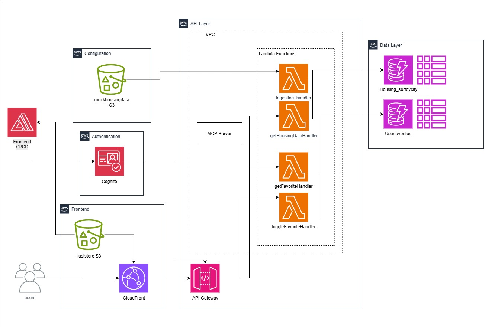

# AWS-Estate

**Live Demo:** [https://dhsfy8233s5x7.cloudfront.net/](https://dhsfy8233s5x7.cloudfront.net/)

This repository contains the source code for a cloud-native real estate application. The frontend is deployed on **Amazon S3** and distributed globally via **Amazon CloudFront**. We implemented a hybrid cloud architecture using AWS to handle authentication, data processing, and API requests.

## Architecture Overview



### **Backend Services**

*   **Compute & Processing:**
    *   **AWS Lambda:** Serverless functions (`getHouseDataHandler`, `getFavoriteHandler`, `toggleFavoriteHandler`) handle API logic and data retrieval.
    *   **Amazon EC2:** Hosts the **MCP (Model Context Protocol) Server**, providing specialized processing alongside our serverless stack.
    *   **GitHub Actions:** Manages the CI/CD pipeline, automatically building and deploying frontend updates to S3.

*   **Storage & Database:**
    *   **Amazon S3:** Two buckets are utilized—one for hosting the static frontend assets (`juststore`) and another for raw housing data ingestion (`mockhousingdata`).
    *   **Amazon DynamoDB:** Stores processed real estate listings and user favorites for low-latency access.

*   **Networking:**
    *   **Amazon VPC:** Provides network isolation for the backend resources (Lambda and EC2), ensuring secure internal communication.
    *   **Amazon CloudFront:** A CDN ensuring low-latency delivery of the frontend to users worldwide.
    *   **Amazon API Gateway:** Acts as the secure entry point, routing client requests to the appropriate Lambda functions.

*   **Security & Auth:**
    *   **Amazon Cognito:** Manages user identity (Sign-up/Sign-in) and secures API access.

*   **Monitoring:**
    *   **Amazon CloudWatch:** Configured to track Lambda metrics and aggregate logs for debugging and performance monitoring.

## Features

- **Property Search**: Filter properties by City, Price Range, Bedrooms, and Bathrooms.
- **User Authentication**: Secure login and session management using **AWS Cognito**.
- **Favorites System**: Save and retrieve favorite properties (persisted via User ID).
- **Responsive UI**: Built with **Radix UI** and **Tailwind CSS** for a polished, accessible, and mobile-friendly experience.
- **Real-time Feedback**: Loading states, error handling, and empty state feedback.

## Tech Stack (Frontend)

- **Framework**: [React](https://react.dev/) with [Vite](https://vitejs.dev/)
- **Language**: TypeScript
- **Styling**: [Tailwind CSS](https://tailwindcss.com/)
- **UI Components**: [Radix UI](https://www.radix-ui.com/) / [shadcn/ui](https://ui.shadcn.com/)
- **Icons**: [Lucide React](https://lucide.dev/)
- **Testing**: Vitest & React Testing Library

## Project Structure

```text
AWS-estate/
├── frontend/               # Main React Application
│   ├── public/             # Static assets
│   ├── src/
│   │   ├── components/     # Reusable UI components (HouseCard, FilterBar, etc.)
│   │   ├── styles/         # Global styles
│   │   ├── App.tsx         # Main application logic & state
│   │   └── main.tsx        # Entry point
│   ├── tests/              # Test setup
│   ├── package.json        # Frontend dependencies
│   └── vite.config.ts      # Vite configuration
├── terminals/              # IDE terminal logs
└── README.md
```

## Getting Started

### Prerequisites
- **Node.js** (v18 or higher recommended)
- **npm** (comes with Node.js)

### Installation

1.  **Clone the repository:**
    ```bash
    git clone <repository-url>
    cd AWS-estate
    ```

2.  **Navigate to the frontend directory:**
    ```bash
    cd frontend
    ```

3.  **Install dependencies:**
    ```bash
    npm install
    ```

### Running Locally

To start the development server:

```bash
npm run dev
```

The application will typically start at `http://localhost:3000`. 

**Note on Authentication**: The app relies on an AWS Cognito token. If you are running locally without a valid token in `localStorage`, you may be redirected or see a restricted view. 

### Building for Production

To create an optimized production build:

```bash
npm run build
```

This will generate static files in the `frontend/build` directory, ready to be deployed to S3, Vercel, or Netlify.

### Testing

Run the test suite using Vitest:

```bash
npm test
```

## Contributing

1.  Create a feature branch (`git checkout -b feature/amazing-feature`).
2.  Commit your changes (`git commit -m 'Add some amazing feature'`).
3.  Push to the branch (`git push origin feature/amazing-feature`).
4.  Open a Pull Request.
